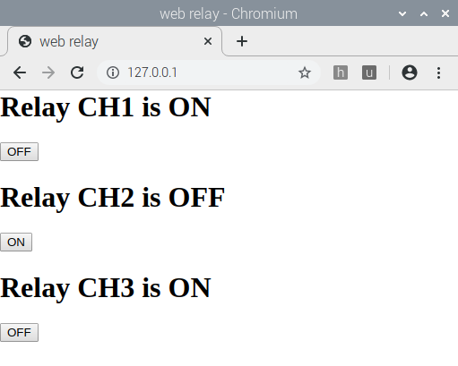

# 在树莓派上搭建php服务器，用于控制继电器扩展板

## raspbian下面安装apache2和php支持包


### apache2的安装

```

sudo apt-get update

sudo apt-get install apache2 

```

安装完毕后，直接可以用浏览器打开 127.0.0.1 ，可以看到apache2的默认网页效果。

**默认网页路径： /var/www/html/index.html**，其中文件的owner是root。所以需要改为pi所有：`sudo chown pi: index.html`


### 让apache支持PHP解析

安装步骤如下：
```

sudo apt-get install php libapache2-mod-php  
```

安装完毕后。把index.html文件删除，或者改名为index.php,输入一下内容：

```
<?php 

echo "你好";

echo date('Y-m-d H:i:s');

phpinfo();

?>
```

以上内容就是在服务器端运行，PHP解析器把命令执行完毕后的结果。在传给apache，然后apache把数据在发给client的浏览器。


### 把写好的网页程序copy到网页主目录上

```
# 取消index.html的默认解析
sudo mv /var/www/html/index.html /var/www/html/index_backup.html

# 拷贝index.php，放到服务器的主目录内
sudo cp /home/pi/rpi_isolated_relay_hat/php/index.php  /var/www/html/ 
```

用树莓派的浏览器访问 http://127.0.0.1 。实现web页的控制




**也可以在同一个局域网内，用手机浏览器访问树莓派的IP地址，从而实现手机控制继电器的目的。**