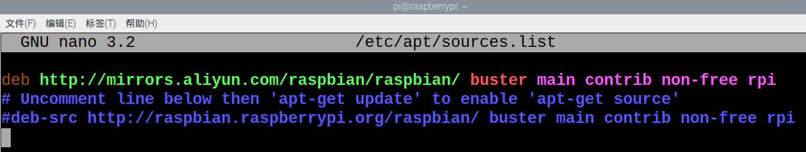

# 树莓派继电器隔离模块使用指南

继电器通道和 Pi 引脚的对应关系：

通道名称  |  RPI的引脚号码  |  WiringPi  |  BCM  
----------  |  ----------|  ----------|  ----------
CH1  |  37  |  P25  |  26
CH2  |  38| P28|  20
CH3  |  40|  P29|  21


## 安装软件库
我们为继电器扩展板，提供了以下软件库：

* shell脚本控制程序
* 基于bcm2835库的c语言控制程序
* 基于wiringPi的控制程序
* 基于python的web页应用程序
* 通过php调用shell脚本控制继电器的程序

为此我们需要在raspbian系统上搭建相应的开发环境，才能进行应用程序的开发。


### 更新软件源
由于raspbian默认的系统设置，软件包会从国外下载，下载成功率较低。建议首先手动更改为国内阿里云的软件源地址。

```
sudo cp /etc/apt/sources.list  /etc/apt/sources.list_backup 

sudo nano /etc/apt/sources.list 

把官方网址改成国内源的网址，例如：
http://mirrors.aliyun.com/raspbian/raspbian/

sudo apt-get update
```
改成如下：



### bcm2835库的安装

```
wget http://www.airspayce.com/mikem/bcm2835/bcm2835-1.60.tar.gz
tar zxvf bcm2835-1.60.tar.gz 
cd bcm2835-1.60/
sudo ./configure
sudo make
sudo make check
sudo make install
# 更多的可以参考官网：http://www.airspayce.com/mikem/bcm2835/
```


### wiringPi库的安装

```
sudo apt-get install wiringpi
#对于树莓派4B可能需要进行升级：
wget https://project-downloads.drogon.net/wiringpi-latest.deb
sudo dpkg -i wiringpi-latest.deb
gpio -v
# 运行gpio -v会出现2.52版本，如果没有出现说明安装出错
```


### 安装Python库

```
sudo apt-get update
sudo apt-get install python-pip
sudo apt-get install python-dev
sudo pip install RPi.GPIO

```


### 下载解压软件包


```
sudo apt-get install p7zip

wget 软件包网址

7zr x RPi_Relay_Board.7z -r -o./RPi_Relay_Board

sudo chmod 777 -R RPi_Relay_Board

cd RPi_Relay_Board

```


## 使用介绍

### shell程序

进入 Linux 终端，在终端执行以下命令：

```
cd shell
sudo ./Relay.sh CH1 ON
sudo ./Relay.sh CH2 ON
sudo ./Relay.sh CH3 OFF
```

