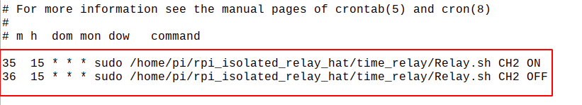

# 树莓派继电器隔离模块使用指南

当你手握树莓派在弱电领域，却从未涉足智能家居等强电领域时，那么来找我。我将为你搭桥牵线，从此树莓派在我的帮助下，控制家电变得so easy，手机控制等各种高大上的玩法随你发挥。


#### 产品特点：

* 基于Raspberry Pi 40pin GPIO接口，兼容 Pi4B、Pi3B+、Pi3B、Pi3A+以及Pi2和PiB+主板。
* 采用3路优质继电器，既能控制交流，也能控制直流。负载能力：交流或直流：5A。触点寿命长达10万次以上。
* 采取双隔离电路方案：树莓派电源隔离和控制信号光藕隔离。让Pi完全隔离在高压电路以外，避免高压电路切换干扰树莓派的运行。
* 带继电器指示灯，方便查看每路继电器的工作状态。
* 带继电器选择跳线帽，方便切换树莓派其他引脚进行控制。
* 可自由设定继电器开启时间和关闭时刻。提供制作可编程时间继电器的配套资料。
* 提供完善的配套软件（包括python、wiringPi、PHP web控制、shell、和bcm2835等控制源代码）


#### 主要技术参数：

技术项目  |  技术参数  
----------  |  ----------
扩展板供电电源  |  5VDC    
树莓派控制方式 | IO口电平控制
继电器控制电压 | 交流、直流均可
继电器最大切换电压 | 277VAC / 30VDC
继电器控制电流  |  5A（交流或直流）
继电器触点寿命 | 10万次以上 


#### 继电器通道和树莓派引脚的对应关系：

通道名称  |  RPI的引脚号码  |  WiringPi  |  BCM  
----------  |  ----------|  ----------|  ----------
CH1  |  37  |  P25  |  26
CH2  |  38| P28|  20
CH3  |  40|  P29|  21


## 硬件接线图


## 安装软件库
我们为继电器扩展板，提供了以下软件库：

* shell脚本控制程序
* 基于bcm2835库的c语言控制程序
* 基于wiringPi的控制程序
* 基于python的web页应用程序
* 通过php调用shell脚本控制继电器的程序
* 制作可编程的时间继电器


为此我们需要先在raspbian系统上搭建相应的开发环境，才能进行应用程序的开发。


### 更新软件源

由于raspbian默认的系统设置，软件包会从国外下载，下载成功率较低。建议首先手动更改为国内阿里云的软件源地址。

```
sudo cp /etc/apt/sources.list  /etc/apt/sources.list_backup 

sudo nano /etc/apt/sources.list 

把官方网址改成国内源的网址，例如：
http://mirrors.aliyun.com/raspbian/raspbian/

sudo apt-get update
```


### bcm2835库的安装

```
wget http://www.airspayce.com/mikem/bcm2835/bcm2835-1.60.tar.gz
tar zxvf bcm2835-1.60.tar.gz 
cd bcm2835-1.60/
sudo ./configure
sudo make
sudo make check
sudo make install
# 更多的可以参考官网：http://www.airspayce.com/mikem/bcm2835/
```


### wiringPi库的安装

```
sudo apt-get install wiringpi
#对于树莓派4B可能需要进行升级：
wget https://project-downloads.drogon.net/wiringpi-latest.deb
sudo dpkg -i wiringpi-latest.deb
gpio -v
# 运行gpio -v会出现2.52版本，如果没有出现说明安装出错
```


### 安装Python库

```
sudo apt-get update
sudo apt-get install python-pip
sudo apt-get install python-dev
sudo pip install RPi.GPIO

```


### 下载解压软件包

从github下载代码库：

```
cd /home/pi

sudo git clone https://github.com/rcdrones/rpi_isolated_relay_hat.git

sudo chmod 777 -R rpi_isolated_relay_hat

cd rpi_isolated_relay_hat

```

或者从网盘下载本资料包（rpi_isolated_relay_hat.zip）,放到/home/pi目录下：

```
cd /home/pi

unzip rpi_isolated_relay_hat.zip

sudo chmod 777 -R rpi_isolated_relay_hat

cd rpi_isolated_relay_hat

```


## 软件使用介绍


### shell程序

进入 Linux 终端，在终端执行以下命令：

```
cd shell
sudo ./Relay.sh CH1 ON
sudo ./Relay.sh CH2 ON
sudo ./Relay.sh CH3 OFF
```

预期结果：继电器通道 1 的 LED 被点亮，同时听到继电器接合的声音。命令中后面两个参数可改变，例如运行如下命令分别为继电器 2 接合，继电器 3 断开。


### BCM2835程序

进入 Linux 终端，在终端执行以下命令：

```
cd bcm2835

make

sudo ./Relay_Module
```

预期结果：可以看到 3 个 LED 依次点亮，继电器依次在常开触点和常闭触点之间来回切换。同时终端会显示目前继电器在哪个触点。


### wiringPi程序

进入 Linux 终端，在终端执行以下命令：

```
cd wiringPi

make

sudo ./Relay_Module
```

预期结果：可以看到 3 个 LED 依次点亮，继电器依次在常开触点和常闭触点之间来回切换。同时终端会显示目前继电器在哪个触点。


### python程序

进入 Linux 终端，在终端执行以下命令：

```
cd python
sudo python Relay_Module.py
```

预期结果：可以看到 3 个 LED 依次点亮，继电器依次在常开触点和常闭触点之间来回切换。同时终端会显示目前继电器在哪个触点。


### 网页控制方式1(基于python-bottle库)

本例程的网页控制是基于 python Web 框架来控制继电器的。
进入 Linux 终端，在终端执行以下命令：

```
sudo apt-get install python-bottle

cd python-bottle

sudo python main.py

```

在谷歌浏览器（其他浏览器可能不兼容）地址栏内输入树莓派 ip 地址，端口号 8000


### 网页控制方式2（基于apache+PHP的控制方式）

可通过手机的浏览器，访问树莓派的IP。从而实现在手机上控制继电器扩展板。
本节教程和php代码在 **rpi_isolated_relay_hat/php/** 文件夹中。


### 制作时间继电器（基于cron和shell脚本）

linux的crontab是用来定时运行某个程序的。有了之前的shell控制脚本，我们就可以创造一个可以编程的时间继电器。

在/home/pi/rpi_isolated_relay_hat/time_relay文件夹下面有触发脚本。

一、首先修改脚本



```
# 关于脚本的解释
# 15点35分运行 /home/pi/rpi_isolated_relay_hat/time_relay/Relay.sh ， 把CH2继电器打开

# 15点36分运行 /home/pi/rpi_isolated_relay_hat/time_relay/Relay.sh ， 把CH2继电器关闭

```

一般我们只需要更改触发的时间，然后更改继电器的通道，再更改ON/OFF即可


二、加载和运行脚本

```
# 查看一下目前系统里的脚本
crontab -l

# 加载脚本
crontab /home/pi/rpi_isolated_relay_hat/time_relay/time.txt

# 再次查看下是否成功
crontab -l

# 可以先设置一小段时间，用来验证继电器触发正确的结果。然后再设置任意时间进行触发。

```

三、卸载脚本

卸载脚本，让时间继电器的功能取消。

```
crontab -r

```


## 机械尺寸图


